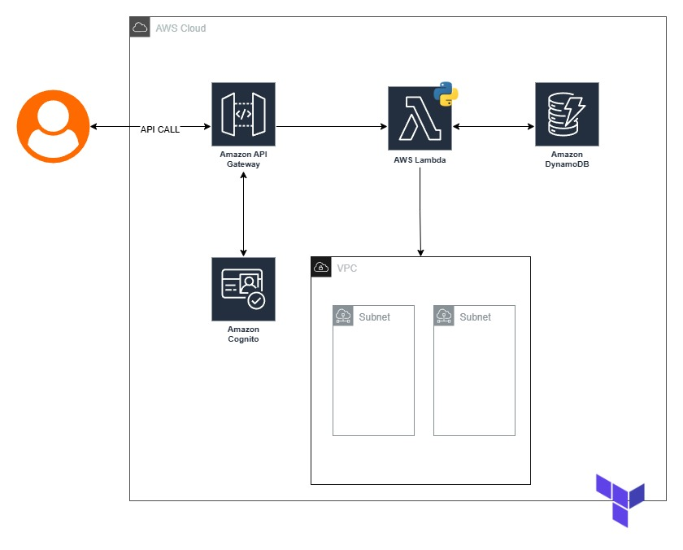

# AWS API Challenge in Python

This repository contains the solution for a technical challenge involving the creation of an API based on AWS services. The API allows creating and managing a VPC with multiple subnets using Python and a serverless architecture.

---

## 🎯 Project Objective

Create an API using AWS services:

- The API should be able to provision a VPC with subnets.
- The business logic must be implemented in Python.
- The API should be protected by an authentication layer.
- Authorization should be granted to all authenticated users.
- The infrastructure setup should be as automated as possible.

---

## 🧱 Solution Architecture



The solution was designed using a **serverless architecture** to ensure scalability, high availability, and cost-efficiency:

- **Amazon API Gateway**: Entry point for the API, exposing endpoints for creating and retrieving the VPC.
- **AWS Lambda**: Business logic written in Python, responsible for interacting with the AWS SDK (Boto3) to provision the VPC and subnets.
- **Amazon DynamoDB**: High-performance NoSQL database to store the details of the created VPCs.
- **Amazon Cognito**: Identity and access management service for API user authentication. A Cognito User Pool was configured to issue JWT tokens validated by the API Gateway.
- **Terraform**: Infrastructure as Code (IaC) tool used to automate the provisioning of all AWS resources.
- **Git and GitHub Actions**: Repository to store the code and automate infrastructure provisioning using Terraform actions.

---

## ✅ Prerequisites

To replicate this infrastructure, you will need:

- An AWS account with access credentials configured.
- Terraform installed.
- GitHub account.

---

## 🚀 Infrastructure Setup and Deployment

The infrastructure is provisioned using Terraform. Follow the steps below to deploy it in your AWS account:

### 1. Fork the Repository

Go to the original repository and click on the **Fork** button in the top-right corner. Then clone your fork:

```bash
git clone https://github.com/<your-username>/<your-repository>.git
cd <your-repository>
```

### 2. Configure Terraform Backend

This project uses an S3 backend to store the Terraform state remotely.  
Create an S3 bucket in your AWS account and update the `backend "s3"` section in the `main.tf` file with your bucket name.

### 3. Update the S3 Bucket for Lambda

This project uses an S3 bucket to store the Python code used in the Lambda function.  
Create an S3 bucket in your AWS account and update the `lambda_code_bucket` variable in the `variables.tf` file with your bucket name.

### 4. Commit Your Changes and Open a Pull Request

Commit your changes and open a pull request to start the `terraform plan`.  
If the plan runs successfully, merge your changes into the `main` branch to trigger the `terraform apply`.

All resources will be created at this step.

---

## 🔐 API Usage

The API is protected by **Cognito authentication**. To make calls to the endpoints, you will need a **valid JWT token**.

### Getting the JWT Token

Follow the login process with a valid Cognito user to obtain an `IdToken`. You can use the AWS CLI for this:

> ⚠️ Before using the API endpoint, you must configure your Cognito user, because the password defined in the `cognito.tf` file is temporary.

Using AWS CloudShell, run the commands below:

```bash
aws cognito-idp admin-initiate-auth --user-pool-id <YOUR_USER_POOL_ID> --client-id <YOUR_CLIENT_ID> --auth-flow ADMIN_NO_SRP_AUTH --auth-parameters USERNAME=challengeuser,PASSWORD=Challenge2025!
```

The above command returns a session token. Copy it and use it in the next command:

```bash
aws cognito-idp admin-respond-to-auth-challenge --user-pool-id <YOUR_USER_POOL_ID> --client-id <YOUR_CLIENT_ID> --challenge-name NEW_PASSWORD_REQUIRED --challenge-responses 'NEW_PASSWORD=<PutYourNewPassword>,USERNAME=challengeuser' --session "<PUT_YOUR_SESSION_TOKEN>"
```

With this information, you can configure your HTTP client to make requests. An example Postman collection is available in the `CollectionExample` folder of this project.

---

## 📌 Available Endpoints

| Method | Endpoint         | Description                                                |
|--------|------------------|------------------------------------------------------------|
| POST   | `/vpcs`          | Creates a new VPC with subnets. Requires a JSON body.      |
| GET    | `/vpcs`          | Retrieves the details of a specific VPC.                   |

---

## 🔄 CI/CD with GitHub Actions

The project uses **GitHub Actions** to automate the CI/CD workflow.

### Workflow:

- **Push to `develop` branch**:  
  When you create a pull request to the `main` branch, it triggers a GitHub Action that runs `terraform plan`.

- **Pull request merged into `main` branch**:  
  After the pull request is merged into `main`, the action runs `terraform apply` to create the infrastructure.

---

## 🧪 How to Use the API Test Collection

A test collection is available in the `CollectionExample` folder of this project. It contains predefined requests for authenticating and interacting with the API. You can import it into **Insomnia** or another API client.

### 🔄 Collection Overview

1. **`1AuthenticationToken`**  
   Responsible for generating the authentication token.  
   This request will return a JWT token if the credentials are correct. The token is required to access the protected endpoints.

2. **`2CreateVpcAndSubnets`**  
   Creates a VPC and its associated subnets.  
   ⚠️ **Important**: Replace the `Authorization` header in this request with the token obtained from `1AuthenticationToken`.  
   Use the format:
   ```
   Authorization: Bearer <your-jwt-token>
   ```

   **Example**:
   ```
   Authorization: Bearer eyJraWQiOiJrS0V...<rest_of_token>
   ```

3. **`3GetVpcAndSubnetsInformations`**  
   Retrieves information about the created VPC and subnets.  
   This request also requires the same token in the `Authorization` header.

---

### 🚀 How to Use It

1. Open **Insomnia**.
2. Go to **File > Import**.
3. Select the `InsomniaChallenge` file from the `collection` folder.
4. Start with the `1AuthenticationToken` request to generate your JWT.
5. Copy the token and add it to the `Authorization` header of requests `2CreateVpcAndSubnets` and `3GetVpcAndSubnetsInformations`, following the `Bearer <token>` format.
6. Send the requests and monitor the responses.